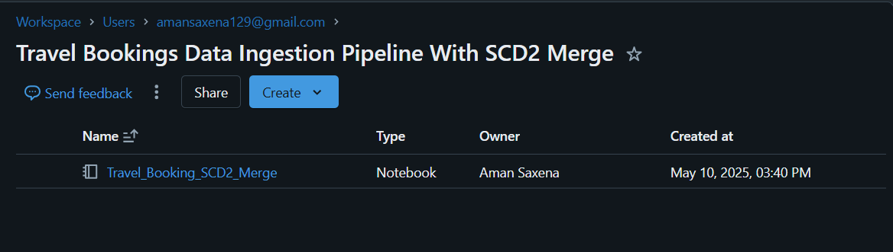

# Travel-Bookings-Data-Ingestion-Pipeline-with-SCD-Type-2-Merge
A scalable data pipeline on Databricks for ingesting daily travel bookings and customer data, enforcing data quality with PyDeequ, and maintaining historical records using SCD Type 2 with Delta Lake.

## 📘 Project Overview
This project presents a robust and scalable data pipeline built on the Databricks Lakehouse Platform. It demonstrates key data engineering principles, including the ingestion and processing of daily travel bookings and customer data, enforcing data quality using PyDeequ, performing analytical aggregations, and maintaining a historical view of customer information through Slowly Changing Dimension Type 2 (SCD Type 2) logic powered by Delta Lake merge capabilities. This pipeline is orchestrated using Databricks Workflows for reliable, automated execution.

## 🏗️ Architecture & Workflow
The workflow orchestrates the following key stages:

`Data Landing & Source:` Daily booking and customer data arrives as CSV files in dedicated folders within a Unity Catalog Volume, providing governed access to raw input.

`Data Ingestion & Initial Processing:` A PySpark notebook reads the daily CSV files.

`Data Validation Gate:` PyDeequ is integrated to perform comprehensive data quality checks on the ingested data. The pipeline is configured to halt upon critical data quality failures, ensuring only reliable data proceeds.

`Business Logic & Transformation:`
Booking records are processed, including calculating derived metrics.
Processed booking data is aggregated for analytical use cases.
Customer data is prepared for historical tracking.

`Data Storage & Management (Delta Lake):`
Aggregated booking data updates a booking_fact table (structured layer).
Processed customer data is merged into a customer_dim table, implementing SCD Type 2 logic to track changes over time.

`Orchestration:` A Databricks Workflow triggers the entire notebook, parameterized to handle daily processing based on the run date

## 🧰 Tech Stack
- Programming	PySpark
- Data Platform	Databricks (Notebook + Workflows)
- Storage	Unity Catalog Volumes
- Format	Delta Lake
- Data Quality	PyDeequ
- Transformation	Spark SQL, PySpark functions

## 📂 Input Datasets

Placed under Unity Catalog Volumes (/Volumes/workspace/default/travel-booking/):
booking_data/bookings_{date}.csv
customer_data/customers_{date}.csv

Each file contains a simulated daily dump with relevant fields like:

Bookings Data: booking_id, customer_id, booking_date, amount, booking_type, quantity, discount, booking_status, hotel_name, flight_number

Customers Data: customer_id, customer_name, customer_address, email, phone_number

## ✅ Data Quality Checks (PyDeequ)

Data quality is a critical gate in this pipeline. PyDeequ is used to define "data quality unit tests" that are executed on the ingested daily data. If any mandatory check fails, the pipeline execution is halted to prevent bad data from affecting downstream tables.

Implemented checks include:

Booking Data:
- Dataset must not be empty (minimum row count).
- booking_id must be unique (ensuring distinct transactions).
- customer_id, amount, booking_date must be complete (no nulls in critical fields).
- amount, quantity, discount must be non-negative (valid numerical values).

Customer Data:
- Dataset must not be empty.
- customer_id must be unique (business key integrity).
- customer_name, customer_address, email must be complete (critical contact/identification info).

Pipeline Halt on Failure: The VerificationSuite in PyDeequ is configured with a check level (CheckLevel.Error) that raises an exception if any defined constraint is violated, stopping the workflow execution immediately..

## 📈 Business Logic & Data Modeling
The pipeline processes the raw data and models it into two key tables for analytical consumption:

`🧮 Booking Fact Table (booking_fact):`
This table stores aggregated booking information, serving as a central point for analyzing booking trends and performance.
Daily booking records are enriched by calculating total_cost (amount - discount).

Data is then aggregated to a desired grain (e.g., by booking_type and customer_id) to provide summarized metrics like total_amount_sum and total_quantity_sum.

This aggregated daily data is appended to the historical booking_fact table, building a growing dataset for historical analysis.

`🧾 Customer Dimension Table (SCD Type 2 customer_dim):`

- This table tracks changes in customer attributes over time, providing a historical view crucial for accurate reporting and analysis (e.g., understanding customer behavior before and after an address change).

- Using customer_id as the business key, the pipeline compares incoming customer records with the existing customer_dim table.

`Delta Lake's MERGE INTO command efficiently handles the SCD Type 2 logic`

- If a record with the same customer_id exists but has changed attributes (like address, email, phone), the existing record's valid_to date is set to the change date of attributes (closing the old version).

- A new record with the updated attributes is then inserted with valid_from as the date of attributes change and valid_to as a placeholder for the far future ('9999-12-31').

- If a record with the customer_id is new, it's simply inserted as a new active record.

- If a record exists and has not changed, no action is taken for that record.

## ⚙️ Databricks Workflow Setup
The entire data pipeline is automated via a Databricks Workflow.

The core PySpark notebook is configured as a task within the workflow.
A key aspect is the use of a Job Parameter (e.g., named Arrival_Date) to pass the processing date to the notebook. For the project demo, this was set to a specific date string (e.g., "2025-05-10").

Workflow is scheduled to run daily, enabling seamless processing of incoming data increments. This setup allows for both easy manual testing (by setting the parameter directly) and reliable production scheduling.

## 📸 Project Screenshots
Cluster setup with Maven (Deequ) & PyPI (PyDeequ) dependencies.

Volume explorer showing booking_data & customer_data folders.

Databricks Notebook.

Check the pyspark script folder for complete code.

Workflow design UI (tasks, parameters, cluster, source notebook).

Workflow run history showing successful runs for multiple dates.

SQL query output showing:

booking_fact with aggregated totals.

customer_dim with versioned records (SCD2 logic in action).

## 🔚 Conclusion
This project is a practical demonstration of:
Real-world incremental ingestion,
SCD2 handling using Delta Lake’s merge capabilities,
Enforcing data quality gates using PyDeequ,
Using workflow orchestration for automating and parameterizing pipelines.

## 💡 Future Enhancements
1. Dynamic Date Capture in Workflow: Instead of manually specifying a date parameter for each run (or relying on a static one), the workflow parameter could leverage Databricks' built-in dynamic value references (e.g., {{job.trigger.time.iso_date}}) to automatically pass the job's trigger date to the notebook.

2. Configurable Data Quality Thresholds: Modify the PyDeequ checks to allow for acceptable failure thresholds (e.g., 1% nulls are acceptable, but >1% halts the pipeline). This would prevent minor data anomalies from stopping the entire process while still catching significant quality issues.

## 👨‍💻 Author
Hi, I’m Aman Saxena!, an aspiring Data Engineer. Feel free to connect on amansaxena129@gmail.com
